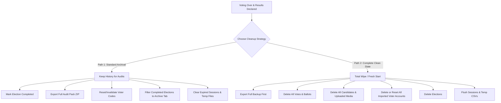

# VoteApp — Django Electronic Voting Application

A full-featured, secure, auditable, and scalable voting application built with Django. Designed for institutions, student unions, corporate boards, and community associations.

---

## 🌟 Key Features

### 🗳️ Voter Experience
- **Voter Dashboard**: Real-time view of active, upcoming, and completed elections.
- **Ballot Casting**: Clean, intuitive voting interface with double-vote prevention.
- **Vote Confirmation & Receipt**: Generates a tamper-evident reference receipt ID (`Vote.reference_id`) for every ballot cast.
- **Public Results View**: Live or post-election candidate vote tallies with breakdown charts and percentage meters when published.

### 🛡️ Admin & Election Management
- **Analytics Dashboards**:
  - **Overview Dashboard**: High-level metrics for active ballots, voters, and recent activity.
  - **Full / Comprehensive Analytics**: Detailed candidate breakdowns, participation rates, and turnout percentages.
- **Election Lifecycle Management**:
  - Create, publish, extend voting windows, end elections, and toggle public result visibility.
  - **Status Filter Tabs**: Filter across **All**, **Active**, **Completed / Archived**, and **Drafts** to keep the workspace uncluttered.
  - **Completed Election Safeguards**: Automatically locks candidate profiles and voting parameters when marked completed to maintain audit integrity.
- **Voter Registry**:
  - Single-voter invitation with instant unique login code generation.
  - **Bulk CSV Import**: Import entire student or member rosters from CSV files.
  - Quick-copy voter login codes and export code rosters.
  - Invalidate or regenerate single-use voter codes between election cycles.

### 📦 Post-Election Best Practices & System Maintenance

#### 🔄 Post-Election Strategy & Cleanup Workflow

```
                       ┌─────────────────────────────────────────┐
                       │  Voting Concluded & Results Declared    │
                       └────────────────────┬────────────────────┘
                                            │
                                            ▼
                       ┌─────────────────────────────────────────┐
                       │       Choose Clean-Up Strategy          │
                       └────────────┬───────────────┬────────────┘
                                    │               │
            ┌───────────────────────┘               └───────────────────────┐
            ▼                                                               ▼
┌───────────────────────────────────────┐       ┌───────────────────────────────────────┐
│  PATH 1: Standard Archival & Reset    │       │     PATH 2: Complete Clean Slate      │
│  (Keep records for audits & history)  │       │     (100% Zero-Data Fresh Start)      │
├───────────────────────────────────────┤       ├───────────────────────────────────────┤
│ 1. Mark Election as "Completed"       │       │ 1. Export Full Database JSON Backup   │
│ 2. Export Full Audit Pack (.ZIP)      │       │ 2. Delete All Ballot Votes            │
│ 3. Reset / Invalidate Voter Codes     │       │ 3. Delete Candidates & Media Images   │
│ 4. Move to "Archived" Filter Tab      │       │ 4. Delete Imported Voter Accounts     │
│ 5. Purge Expired Django Sessions      │       │ 5. Delete Elections & Flush Sessions  │
└───────────────────────────────────────┘       └───────────────────────────────────────┘
```



- **One-Click Audit Pack Export (.ZIP)**: Download a full audit package for any completed election containing:
  - `official_results.csv`: Candidate vote totals and percentages.
  - `voter_turnout.csv`: Participation roster and timestamps.
  - `ballot_receipts_audit.csv`: Anonymized vote reference IDs and cast timestamps for verification.
  - `election_summary.json`: Complete election metadata.
- **System Maintenance Hub (`/admin-panel/maintenance/`)**:
  - Full database JSON backups (`dumpdata`).
  - Purge expired user sessions (`clearsessions`).
  - Reset / rotate voter login codes.
  - **Danger Zone**: Choose between **Wiping Votes Only** (clearing ballots while preserving candidate rosters) and **Complete System Wipe** (total clean slate restoring zero data while safely retaining superuser access), protected by a `RESET` confirmation keyword.
- **CLI Maintenance Utility (`python manage.py post_election_cleanup`)**: Command-line automation for archiving, backups, session purging, and data wipes with dry-run support.

### 🔒 Security & Performance
- **Role-Based Access Control (RBAC)**: Fine-grained separation of duties between 5 distinct roles:
  - **System Administrator** (`admin`): Infrastructure, backups, database wipes, and staff role delegation.
  - **Electoral Commissioner** (`officer`): Election creation, candidate rosters & bios, deadline extensions, and results certification.
  - **Voter Registrar** (`registrar`): Roster management, CSV roster imports, single invites, and code rotation.
  - **Election Auditor** (`auditor`): Independent oversight, live turnout stats, and audit package ZIP export.
  - **Voter** (`voter`): Secure ballot casting, double-vote prevention, and receipt tracking.
- **Ballot Secrecy & Verification**: Voters receive receipt IDs for verification while preserving the secrecy of their vote.
- **Session & Rate Limit Protection**: Built-in rate limiting on administrative actions and automatic session management.
- **Cloudinary CDN Integration**: Persistent candidate photos across cloud deployments (Render, Heroku, Railway).

---

## 🗺️ Application Routes & Page Index

| Area | Page | URL | Permitted Roles | Description |
|---|---|---|---|---|
| **Authentication** | Login | `/accounts/login/` | All / Public | Password or unique voter code login |
| | Register | `/accounts/register/` | Public | Self-registration (when enabled) |
| | Logout Confirm | `/accounts/logout/` | Authenticated | Clean session termination |
| **Voter Portal** | Voter Dashboard | `/elections/dashboard/` | Voters & Staff | Overview of ballots & participation |
| | Cast Ballot | `/elections/<id>/ballot/` | Eligible Voters | Interactive voting ballot |
| | Vote Confirmation | `/elections/confirmation/<id>/` | Voters | Receipt with Reference ID |
| | Public Results | `/elections/<id>/results/` | All / Public | Certified candidate vote results |
| **Admin Panel** | Admin Dashboard | `/admin-panel/` | Admin, Officer, Registrar, Auditor | Quick overview & recent activity |
| | Full Analytics | `/admin-panel/comprehensive/` | Admin, Officer, Registrar, Auditor | Complete election & candidate metrics |
| | Elections Roster | `/admin-panel/elections/` | Admin, Officer, Registrar, Auditor | Filterable election list (Active, Archived, Drafts) |
| | Create Election | `/admin-panel/elections/create/` | Admin, Officer | New election configuration |
| | Manage Election | `/admin-panel/elections/<id>/manage/` | Admin, Officer | Candidates, settings & audit banner |
| | Extend Voting | `/admin-panel/elections/<id>/extend/` | Admin, Officer | Add hours/days to voting window |
| | Live / Certified Results | `/admin-panel/elections/<id>/results/` | Admin, Officer, Auditor | Admin live tally & CSV exporter |
| | Election Audit Pack | `/admin-panel/elections/<id>/audit-pack/` | Admin, Officer, Auditor | Download complete audit ZIP |
| | Voter Registry | `/admin-panel/voters/` | Admin, Officer, Registrar, Auditor | Registered voters with search & filter |
| | Invite Voter | `/admin-panel/voters/invite/` | Admin, Registrar | Individual voter invitation |
| | CSV Import | `/admin-panel/voters/import/` | Admin, Registrar | Bulk voter import from CSV |
| | Reset Voter Codes | `/admin-panel/voters/reset-codes/` | Admin, Registrar | Invalidate/regenerate login codes |
| | Staff & Roles | `/admin-panel/staff/` | System Admin | Assign and manage staff accounts & roles |
| | Maintenance & Reset | `/admin-panel/maintenance/` | System Admin | Backup, session purge & clean slate wipe |
| **Django Core** | Django Admin | `/django-admin/` | Superusers | Low-level Django ORM administration |

---

## ⚡ Quick Start

### Automated Setup
```bash
chmod +x setup.sh
./setup.sh
```

### Manual Setup
```bash
# 1. Create and activate virtual environment
python -m venv venv
source venv/bin/activate       # Windows: venv\Scripts\activate

# 2. Install dependencies
pip install -r requirements.txt

# 3. Run database migrations
python manage.py makemigrations accounts
python manage.py makemigrations elections
python manage.py migrate

# 4. Seed demo data (creates admin + staff roles + sample voters + sample elections)
python manage.py seed_demo

# 5. Start the development server
python manage.py runserver
```
Visit: `http://127.0.0.1:8000`

---

## 🔑 Demo Accounts

| Role | Username / Email | Password | Voter Login Code | Scope & Capabilities |
|---|---|---|---|---|
| **System Administrator** | `admin@voteapp.com` | `admin123` | N/A | Full Control: Maintenance Hub, Backups, Data Wipes, Staff Roles |
| **Electoral Commissioner** | `commissioner@voteapp.com` | `officer123` | N/A | Elections & Candidate Bios, Deadlines, Results Certification |
| **Voter Registrar** | `registrar@voteapp.com` | `registrar123` | N/A | Voter Registry, CSV Roster Imports, Single Invites, Code Resets |
| **Election Auditor** | `auditor@voteapp.com` | `auditor123` | N/A | Read-Only Oversight, Live Turnout Metrics, Audit ZIP Downloads |
| **Voter** | `alice@example.com` | `voter123` | `ALICE123` | Voter Portal, Ballot Casting, Reference Receipt Tracking |
| **Voter** | `bob@example.com` | `voter123` | `BOB12345` | Voter Portal, Ballot Casting, Reference Receipt Tracking |
| **Voter** | `carol@example.com` | `voter123` | `CAROL123` | Voter Portal, Ballot Casting, Reference Receipt Tracking |


---

## 🛠️ Useful Management Commands

### 1. Post-Election Maintenance & Cleanup
```bash
# Preview actions without making changes
python manage.py post_election_cleanup --dry-run --clear-sessions --reset-voter-codes

# Archive a specific election (exports CSVs and JSON summary to archives/)
python manage.py post_election_cleanup --archive <election_uuid>

# Reset voter login codes for a new election cycle
python manage.py post_election_cleanup --reset-voter-codes

# Regenerate fresh login codes for all voters
python manage.py post_election_cleanup --regenerate-codes

# Purge expired sessions from database
python manage.py post_election_cleanup --clear-sessions

# Total system wipe (creates backup first, deletes votes, candidates, elections, non-admin voters)
python manage.py post_election_cleanup --wipe-all --backup
```

### 2. Seeding Demo Data
```bash
python manage.py seed_demo
```

### 3. Running Automated Tests
```bash
python manage.py test
```

---

## 📂 Project Structure

```
voteapp/
├── manage.py
├── requirements.txt
├── setup.sh
├── setup_cloudinary.md        # Cloudinary media configuration guide
├── sample_data/               # Sample CSV files for import testing
│   ├── test-data.csv
│   ├── test-import.csv
│   ├── test-real-data.csv
│   └── vote-data.csv
├── archives/                  # Generated election audit packs (ZIP/CSV/JSON)
├── backups/                   # Database JSON snapshots
├── voteapp/                   # Core Django project config
│   ├── settings.py
│   ├── urls.py
│   └── wsgi.py
├── accounts/                  # Authentication & custom user model
│   ├── models.py              # CustomUser with role, unique_code, is_verified
│   ├── forms.py
│   ├── views.py
│   └── tests.py
├── elections/                 # Election domain models and voter portal
│   ├── models.py              # Election, Candidate, Vote
│   ├── views.py               # Voter dashboard, ballot, results
│   ├── management/
│   │   └── commands/
│   │       ├── seed_demo.py
│   │       └── post_election_cleanup.py
│   └── tests.py
├── admin_panel/               # Administrative suite & maintenance hub
│   ├── views.py               # Dashboards, exports, audit packs, resets, wipes
│   ├── forms.py
│   ├── security.py
│   └── tests.py
├── templates/                 # Glassmorphic & modern HTML templates
│   ├── base.html
│   ├── accounts/
│   ├── elections/
│   └── admin_panel/
├── static/                    # CSS stylesheets, icons, and JavaScript
└── media/                     # Local uploaded candidate images (fallback)
```

---

## 🌐 Production Deployment Notes

1. **Environment Variables**: Set `SECRET_KEY`, `DEBUG=False`, and `ALLOWED_HOSTS`.
2. **Database**: Use PostgreSQL in production (e.g. Supabase, Render PostgreSQL, AWS RDS).
3. **Media Storage**: Set up Cloudinary credentials (`CLOUDINARY_CLOUD_NAME`, `CLOUDINARY_API_KEY`, `CLOUDINARY_API_SECRET`) as detailed in [setup_cloudinary.md](setup_cloudinary.md).
4. **Static Files**: Run `python manage.py collectstatic --noinput` (WhiteNoise is pre-configured).
5. **Periodic Maintenance**: Schedule `python manage.py clearsessions` via cron or Render background worker.
